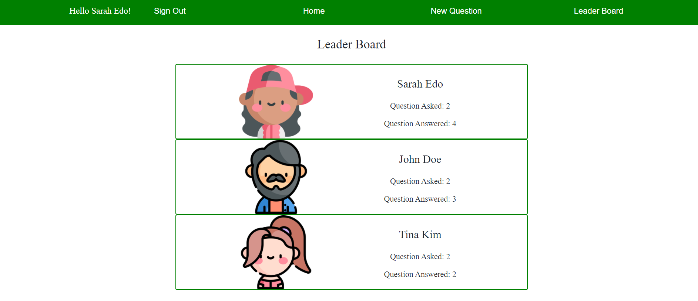

# Would You Rather❓

Would You Rather is a polling game that presents the user with a series of questions.

<!--  -->

It's built with React, Redux, React Router, & Redux Thunk.

This app is the second of three projects required for [Udacity's React Nanodegree program](https://www.udacity.com/course/react-nanodegree--nd019).

<!-- - **Live Demo:** [https://reactnd-would-you-rather.netlify.com](https://reactnd-would-you-rather.netlify.com/)
- **Code Notes:** [Step-by-step walk-though of how this project was built](https://james-priest.github.io/reactnd-project-would-you-rather/) -->

## Installation

Clone the repository, change directories, and use NPM to install the dependencies.

```bash
$ git clone https://github.com/jiwonhan1/WouldYouRather.git
$ cd reactnd-project-would-you-rather
$ npm install
```

## Usage

The project can be run with

- `npm start`

The project can be viewed in the browser at

- [http://localhost:3000](http://localhost:3000)

## Screenshots



## Developer

I am Jiwon who is devlving into Front-end development with React! Any feedback is appreciated!🥰
